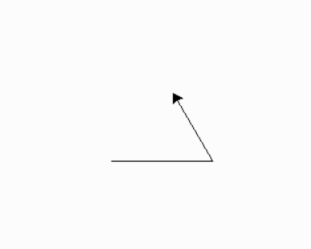
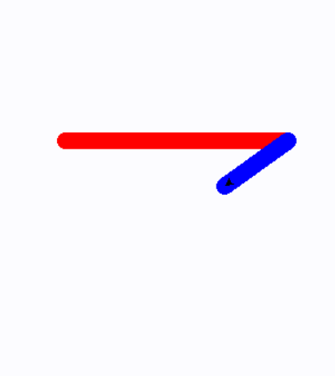
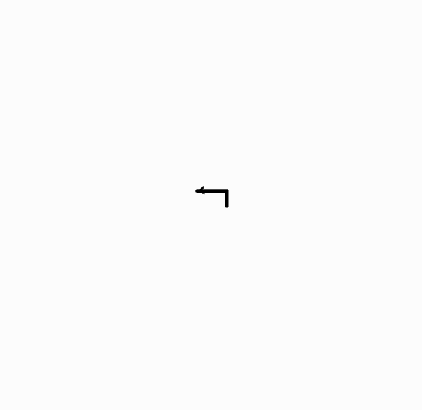
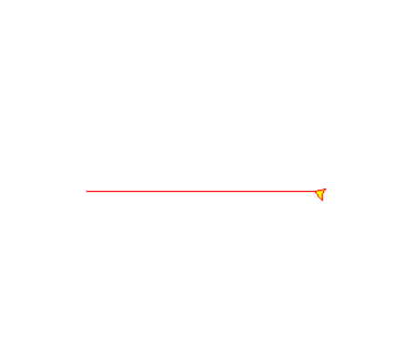

<h1>Fractal - Turtle

<h2>Aplicação Simples Usando Fractal e Turtle

<h3>Fractal é uma figura geométrica que se repete em diferentes escalas, formando uma estrutura complexa. Turtle é uma ferramenta de programação que permite desenhar figuras geométricas na tela do computador com comandos simples. A turtle pode ser usada para criar imagens fractais, que são construídas a partir de padrões repetitivos programados com comandos de movimento da turtle.


<h3>Para iniciar precisamos instalar a biblioteca chamada Python Turtle pelo Python Packets do Pycharm

<h3>Abaixo, serão exibidos alguns exemplos de Fractal:

<h4> 1° exemplo é o triangulo:

<p align="center">
    
</p>

<h4> - Abaixo é exibido o código utilizado para gerar esse fractal:

```javascript
import turtle

turtle.forward(100)
turtle.left(120)
turtle.forward(100)
turtle.left(120)
turtle.forward(100)

turtle.done()
```

<h4>2° exemplo é a estrela colorida:

<p align="center">
    
</p>

<h4> - Abaixo é exibido o código utilizado para gerar esse fractal:

```javascript
import turtle

cor = ['red', 'blue', 'green', 'purple', 'black']

turtle.pensize(15)

turtle.penup()
turtle.pendown()

for i in range(5):
    turtle.pencolor(cor[i])
    turtle.forward(200)
    turtle.right(144)

turtle.done()
```


<h4> 3° exemplo é a espiral quadrada:

<p align="center">
    
</p>

<h4> Abaixo é exibido o código utilizado para gerar esse fractal:

```javascript
import turtle


turtle.pensize(5)

turtle.penup()
turtle.pendown()

for i in range(0,500,20):
    turtle.forward(i)
    turtle.left(90)

turtle.done()
```

<h4> 4° exemplo é uma estrela colorida, chegando quase a ser um girassol, com traços mais complexos:

<p align="center">
    
</p>

<h4> - Abaixo é exibido o código utilizado para gerar esse fractal:

```javascript
import turtle

turtle.color('red', 'yellow')
turtle.begin_fill()

while True:
    turtle.forward(200)
    turtle.left(170)
    if abs(turtle.pos()) < 1:
        break

turtle.end_fill()
turtle.done()
```

<h4> Agora é a sua vez de se divertir e criar novos fractal's, mão na massa! :)